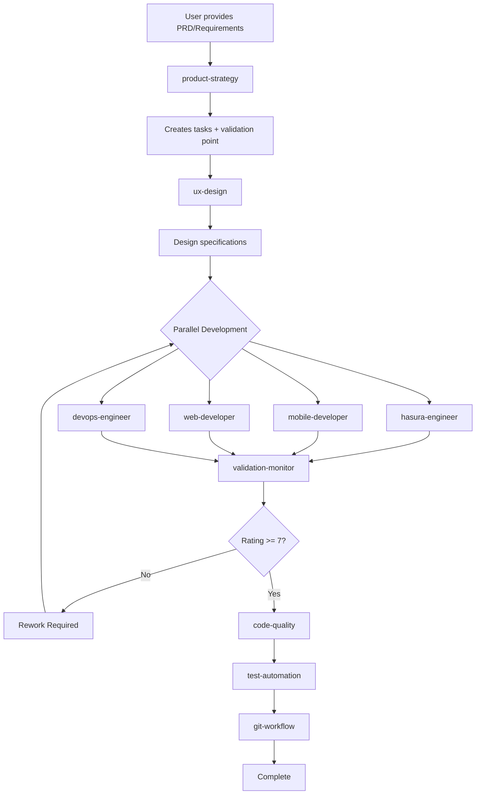

# Claude Code Agents - Complete Documentation

## 🎯 Final Configuration: 10 Specialized Agents

This document consolidates all agent documentation for the 100days.fit project, optimized for solo developer productivity with enterprise-grade quality.

## 📊 Agent Overview

| Agent | Model | Purpose | Activation |
|-------|-------|---------|------------|
| [product-strategy](#product-strategy) | opus | PRD analysis, task creation | Entry point for new work |
| [ux-design](#ux-design) | opus | UI/UX patterns, animations | After product tasks created |
| [hasura-engineer](#hasura-engineer) | opus | GraphQL API, database | API/backend tasks |
| [mobile-developer](#mobile-developer) | opus | React Native app | Mobile app tasks |
| [web-developer](#web-developer) | opus | Next.js website | Website tasks |
| [devops-engineer](#devops-engineer) | opus | Infrastructure, CI/CD | Infrastructure needs |
| [code-quality](#code-quality) | sonnet | Code review | After implementation |
| [test-automation](#test-automation) | sonnet | Test generation | After code changes |
| [git-workflow](#git-workflow) | default | Git operations + safety | ALL git operations |
| [validation-monitor](#validation-monitor) | sonnet | Continuous validation | Automatic after each agent |

## 🚀 Standard Workflow



## 📋 Individual Agent Specifications

### product-strategy
**Model**: opus  
**Layer**: Planning  
**Tools**: Read, WebSearch, WebFetch, Bash, Grep, mcp__sequential-thinking__sequentialthinking, TodoWrite

**Responsibilities**:
- Analyze PRDs and research documents
- Market validation via WebSearch
- Create executable backlog tasks
- Provide user verification checkpoint
- Bridge business requirements to technical specs

**Activation**: 
```bash
"@product-strategy analyze @backlog/docs/100days-fit-PRD.md"
```

**Output**: Backlog tasks with IDs, verification document

---

### ux-design
**Model**: opus  
**Layer**: Design  
**Tools**: Read, WebSearch, WebFetch, mcp__context7__resolve-library-id, mcp__context7__get-library-docs, Grep, Write

**Responsibilities**:
- UI/UX pattern research and documentation
- Animation specifications and timing curves
- Haptic feedback patterns
- Design system consistency
- Platform-specific guidelines

**Activation**:
```bash
"@ux-design create specs for [feature]"
```

**Output**: Design guides in `.claude/guides/`

---

### hasura-engineer
**Model**: opus  
**Layer**: Development  
**Tools**: Read, Write, Edit, Bash, TodoWrite, MultiEdit, Grep, LS

**Responsibilities**:
- GraphQL schema design
- Database migrations
- Hasura metadata management
- Lambda functions
- Business logic implementation

**Activation**:
```bash
"@hasura-engineer implement [API feature]"
```

**Working Directory**: `/api-gateway`

---

### mobile-developer
**Model**: opus  
**Layer**: Development  
**Tools**: Read, Write, Edit, MultiEdit, Bash, TodoWrite, Grep

**Responsibilities**:
- React Native/Expo development
- Platform-specific features (iOS/Android)
- Mobile components and navigation
- NativeWind styling
- App state management

**Activation**:
```bash
"@mobile-developer implement [mobile feature]"
```

**Working Directory**: `/app`

---

### web-developer
**Model**: opus  
**Layer**: Development  
**Tools**: Read, Write, Edit, MultiEdit, Bash, TodoWrite, Grep

**Responsibilities**:
- Next.js 14 App Router development
- SSR/SSG implementation
- DaisyUI component integration
- SEO optimization
- Web-specific features

**Activation**:
```bash
"@web-developer implement [web feature]"
```

**Working Directory**: `/website`

---

### devops-engineer
**Model**: opus  
**Layer**: Development  
**Tools**: Read, Write, Bash, TodoWrite

**Responsibilities**:
- Railway deployment for Hasura
- Vercel deployment for Next.js  
- Cloudflare Workers management
- NeonDB database operations
- GitHub Actions CI/CD
- Built-in platform monitoring

**Activation**:
```bash
"@devops-engineer deploy to Railway"
"@devops-engineer setup Cloudflare Workers"
```

---

### code-quality
**Model**: sonnet  
**Layer**: Quality  
**Tools**: Read, Bash, Grep, mcp__sequential-thinking__sequentialthinking

**Responsibilities**:
- Code review and best practices
- TypeScript enforcement
- Security vulnerability detection
- Architecture compliance
- Performance analysis

**Activation**: Automatic after implementation or on request

**Output**: Review report with pass/fail decision

---

### test-automation
**Model**: sonnet  
**Layer**: Quality  
**Tools**: Read, Write, Edit, MultiEdit, Bash, Grep, LS, TodoWrite

**Responsibilities**:
- Test suite generation (unit, integration, e2e)
- Test execution and coverage reporting
- Regression test creation
- Quality gate enforcement
- Test maintenance

**Activation**: Automatic after code changes

**Coverage Requirements**: 
- New features: 90%+
- Bug fixes: Must include regression test
- Critical paths: 100%

---

### git-workflow
**Model**: default  
**Layer**: Operations  
**Tools**: Read, Write, Edit, Bash, TodoWrite, mcp__sequential-thinking__sequentialthinking

**Critical**: MUST be used for ALL git operations

**Safety Systems**:
- **Backup**: Before any destructive operation
- **Worktree**: For parallel Claude sessions
- **Dry-run**: Preview before execution
- **Undo**: Rollback last operations
- **Branch Protection**: No direct main commits

**Activation**:
```bash
"@git-workflow commit changes"
"@git-workflow create PR"
```

---

### validation-monitor
**Model**: sonnet  
**Layer**: Validation  
**Tools**: Read, Grep, Bash, mcp__sequential-thinking__sequentialthinking

**Responsibilities**:
- Continuous validation after every agent action
- Hallucination detection and prevention
- Specification compliance checking
- Quality rating (1-10 scale)
- Rework guidance

**Automatic Activation**: After any development agent completes work

**Rating System**:
- 9-10: Excellent, exceeds specs
- 7-8: Good, approved to proceed
- 5-6: Needs improvement
- 3-4: Major issues, rework required
- 1-2: Critical failure, blocked

**Output**: Validation report with rating and specific feedback

---

## 💡 Usage Examples

### Complete Feature Implementation

```bash
# 1. Start with PRD
"@product-strategy analyze @backlog/docs/daily-checkin-PRD.md"

# 2. Review tasks
"Approve task breakdown"

# 3. Design phase
"@ux-design create specs for daily check-in feature"

# 4. Implementation (parallel possible)
"@hasura-engineer create daily_entries table and GraphQL API"
"@mobile-developer implement daily check-in screen"
"@web-developer create progress dashboard"

# 5. Infrastructure if needed
"@devops-engineer setup cron job for daily reminders"

# validation-monitor runs automatically after each step

# 6. Quality assurance
"@code-quality review all changes"
"@test-automation generate comprehensive tests"

# 7. Version control
"@git-workflow create feature branch and commit"
```

### Quick Bug Fix

```bash
"@mobile-developer fix crash on startup issue #456"
# validation-monitor checks fix
"@test-automation add regression test"
"@git-workflow commit hotfix"
```

### Infrastructure Update

```bash
"@devops-engineer scale Railway deployment"
# validation-monitor reviews configuration
"@devops-engineer update NeonDB compute size"
```

## 🔧 Agent Communication

### Information Flow Paths

1. **Specifications**: `.claude/guides/[feature]-spec.md`
2. **Tasks**: Backlog system with IDs
3. **Validation Reports**: `.claude/reviews/validation-[timestamp].md`
4. **State Management**: `.claude/state/`

### Handoff Protocol

```
product-strategy → Tasks with IDs
     ↓
ux-design → Design specifications
     ↓
Development agents → Implementation
     ↓
validation-monitor → Quality rating
     ↓
code-quality → Review approval
     ↓
test-automation → Test coverage
     ↓
git-workflow → Version control
```

## 📊 Model Strategy

### Opus 4.1 (Complex/Creative)
Used for agents requiring:
- Complex analysis and strategy
- Creative design decisions
- Sophisticated implementation
- Architecture planning

### Sonnet 3.5 (Validation/Systematic)
Used for agents requiring:
- Pattern matching
- Systematic generation
- Frequent execution
- Rule-based validation

## 🛡️ Safety Systems

### Integrated Protections

1. **Backup System** (`backup.js`)
   - Automatic before destructive operations
   - 24-hour retention
   - Quick restore capability

2. **Worktree Management** (`worktree.js`)
   - Parallel session isolation
   - No merge conflicts
   - Clean workspace per session

3. **Dry-Run Mode** (`dry-run.js`)
   - Preview without execution
   - Impact analysis
   - Safety verification

4. **Undo Stack** (`undo.js`)
   - Last 10 operations reversible
   - Operation tracking
   - Quick rollback

5. **Validation Monitor**
   - Continuous quality checks
   - Hallucination prevention
   - Architecture enforcement

## 🎯 Key Benefits

### For Solo Developer

1. **Multiplied Productivity**
   - Automated reviews catch issues early
   - Parallel agent execution
   - Clear handoffs between phases

2. **Enterprise Quality**
   - Continuous validation
   - Enforced best practices
   - Comprehensive testing

3. **Scalability Built-In**
   - Clean architecture from start
   - Infrastructure automation
   - Maintainable codebase

4. **Safety First**
   - Multiple rollback options
   - Validation before commits
   - Protected main branch

## 🚨 Critical Rules

1. **ALWAYS use git-workflow** for ANY git operation
2. **NEVER skip validation-monitor** ratings
3. **product-strategy is entry point** for new work
4. **Wait for rating >= 7** before proceeding
5. **Development agents use opus** model
6. **Quality agents use sonnet** model

## 📈 Success Metrics

Track these to measure system effectiveness:

- **Development Velocity**: Tasks/day
- **Quality Score**: Average validation rating
- **Rework Rate**: First-attempt success
- **Test Coverage**: Maintained >80%
- **Production Incidents**: Deployment success rate

## 🔄 Maintenance

### System Updates
- Review agent performance monthly
- Update validation rules as patterns emerge
- Refine model assignments based on usage
- Document new patterns in decision log

### Adding Capabilities
1. Assess if fits existing agent domain
2. If new domain, create specialized agent
3. Update validation-monitor rules
4. Document in this file

---

*This configuration has been optimized through extensive research and real-world testing to provide maximum productivity for solo developers while maintaining enterprise-grade quality standards.*