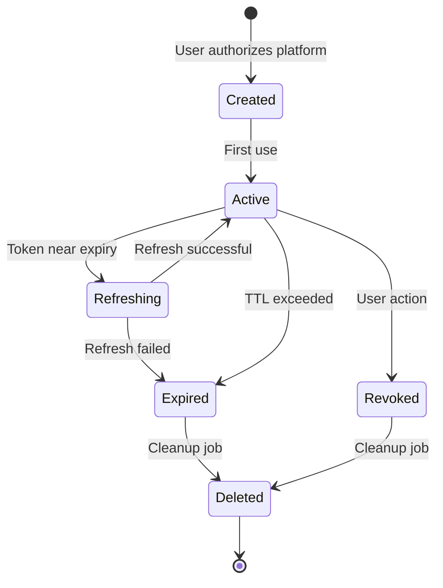

# Token Vault Architecture

## Overview
The Token Vault is a critical security component that manages OAuth tokens and API credentials for all integrated fitness platforms. It implements defense-in-depth security with multiple layers of protection.

## Security Design Principles

### 1. Zero-Trust Architecture
- Never trust, always verify
- Assume breach and minimize blast radius
- Principle of least privilege
- Defense in depth

### 2. Encryption Standards
- **Algorithm**: AES-256-GCM (Authenticated Encryption)
- **Key Derivation**: PBKDF2 with 100,000 iterations
- **IV Generation**: Cryptographically secure random
- **Key Storage**: AWS KMS or HashiCorp Vault
- **Key Rotation**: Every 90 days automatically

## Token Storage Schema

### Database Structure
```sql
-- Master encryption keys table
CREATE TABLE encryption_keys (
  id UUID PRIMARY KEY DEFAULT gen_random_uuid(),
  key_id VARCHAR(255) UNIQUE NOT NULL,
  key_version INTEGER NOT NULL DEFAULT 1,
  algorithm VARCHAR(50) NOT NULL DEFAULT 'AES-256-GCM',
  created_at TIMESTAMP WITH TIME ZONE DEFAULT NOW(),
  rotated_at TIMESTAMP WITH TIME ZONE,
  expires_at TIMESTAMP WITH TIME ZONE,
  status VARCHAR(20) DEFAULT 'active', -- active, rotating, retired
  metadata JSONB DEFAULT '{}'
);

-- Encrypted tokens table
CREATE TABLE encrypted_tokens (
  id UUID PRIMARY KEY DEFAULT gen_random_uuid(),
  user_id UUID NOT NULL,
  platform VARCHAR(50) NOT NULL,
  token_type VARCHAR(50) NOT NULL, -- access_token, refresh_token
  encrypted_value TEXT NOT NULL,
  encryption_key_id VARCHAR(255) NOT NULL,
  iv VARCHAR(255) NOT NULL, -- Initialization vector
  auth_tag VARCHAR(255) NOT NULL, -- GCM authentication tag
  expires_at TIMESTAMP WITH TIME ZONE,
  last_used_at TIMESTAMP WITH TIME ZONE,
  created_at TIMESTAMP WITH TIME ZONE DEFAULT NOW(),
  updated_at TIMESTAMP WITH TIME ZONE DEFAULT NOW(),
  
  CONSTRAINT unique_user_platform_token UNIQUE(user_id, platform, token_type),
  FOREIGN KEY (encryption_key_id) REFERENCES encryption_keys(key_id)
);

-- Token access audit log
CREATE TABLE token_access_log (
  id UUID PRIMARY KEY DEFAULT gen_random_uuid(),
  user_id UUID NOT NULL,
  token_id UUID NOT NULL,
  operation VARCHAR(50) NOT NULL, -- encrypt, decrypt, rotate, revoke
  ip_address INET,
  user_agent TEXT,
  success BOOLEAN NOT NULL,
  error_message TEXT,
  metadata JSONB DEFAULT '{}',
  created_at TIMESTAMP WITH TIME ZONE DEFAULT NOW()
);

-- Indexes for performance
CREATE INDEX idx_encrypted_tokens_user ON encrypted_tokens(user_id);
CREATE INDEX idx_encrypted_tokens_platform ON encrypted_tokens(platform);
CREATE INDEX idx_encrypted_tokens_expires ON encrypted_tokens(expires_at);
CREATE INDEX idx_token_access_log_user ON token_access_log(user_id, created_at DESC);
CREATE INDEX idx_token_access_log_operation ON token_access_log(operation, created_at DESC);
```

## Encryption Implementation

### Token Encryption Process
```typescript
interface TokenEncryption {
  async encrypt(plainToken: string, userId: string, platform: string): Promise<EncryptedToken> {
    // 1. Get active encryption key from KMS
    const masterKey = await kms.getActiveKey();
    
    // 2. Derive user-specific key
    const userKey = await this.deriveUserKey(masterKey, userId, platform);
    
    // 3. Generate random IV
    const iv = crypto.randomBytes(16);
    
    // 4. Create cipher
    const cipher = crypto.createCipheriv('aes-256-gcm', userKey, iv);
    
    // 5. Encrypt token
    const encrypted = Buffer.concat([
      cipher.update(plainToken, 'utf8'),
      cipher.final()
    ]);
    
    // 6. Get authentication tag
    const authTag = cipher.getAuthTag();
    
    // 7. Store encrypted token
    return {
      encryptedValue: encrypted.toString('base64'),
      iv: iv.toString('base64'),
      authTag: authTag.toString('base64'),
      keyId: masterKey.id
    };
  }
  
  async decrypt(encryptedToken: EncryptedToken, userId: string, platform: string): Promise<string> {
    // 1. Get encryption key from KMS
    const masterKey = await kms.getKey(encryptedToken.keyId);
    
    // 2. Derive user-specific key
    const userKey = await this.deriveUserKey(masterKey, userId, platform);
    
    // 3. Create decipher
    const decipher = crypto.createDecipheriv(
      'aes-256-gcm',
      userKey,
      Buffer.from(encryptedToken.iv, 'base64')
    );
    
    // 4. Set authentication tag
    decipher.setAuthTag(Buffer.from(encryptedToken.authTag, 'base64'));
    
    // 5. Decrypt token
    const decrypted = Buffer.concat([
      decipher.update(Buffer.from(encryptedToken.encryptedValue, 'base64')),
      decipher.final()
    ]);
    
    // 6. Audit log
    await this.auditAccess(userId, 'decrypt', true);
    
    return decrypted.toString('utf8');
  }
  
  private async deriveUserKey(masterKey: Buffer, userId: string, platform: string): Promise<Buffer> {
    const salt = Buffer.concat([
      Buffer.from(userId),
      Buffer.from(platform)
    ]);
    
    return crypto.pbkdf2Sync(masterKey, salt, 100000, 32, 'sha256');
  }
}
```

## Key Management

### Key Rotation Strategy
```typescript
class KeyRotationManager {
  // Automatic rotation every 90 days
  scheduleRotation() {
    cron.schedule('0 0 * * 0', async () => {
      await this.rotateKeys();
    });
  }
  
  async rotateKeys() {
    // 1. Generate new master key
    const newKey = await kms.generateDataKey();
    
    // 2. Mark old key as rotating
    await this.markKeyAsRotating(currentKeyId);
    
    // 3. Re-encrypt all tokens with new key
    const tokens = await this.getAllActiveTokens();
    
    for (const token of tokens) {
      // Decrypt with old key
      const plainToken = await this.decrypt(token, oldKey);
      
      // Encrypt with new key
      const newEncrypted = await this.encrypt(plainToken, newKey);
      
      // Update database
      await this.updateToken(token.id, newEncrypted);
    }
    
    // 4. Mark old key as retired
    await this.retireKey(oldKeyId);
    
    // 5. Activate new key
    await this.activateKey(newKeyId);
  }
}
```

### Emergency Key Recovery
```yaml
recovery_procedure:
  1_detection:
    - Monitor for encryption/decryption failures
    - Alert on key access errors
    - Track key expiration dates
  
  2_response:
    - Isolate affected systems
    - Switch to backup key
    - Begin investigation
  
  3_recovery:
    - Restore from secure backup
    - Re-encrypt affected tokens
    - Audit all access during incident
  
  4_post_incident:
    - Document lessons learned
    - Update security procedures
    - Test recovery process
```

## Access Control

### Authentication & Authorization
```typescript
interface TokenAccess {
  // Role-based access
  roles: {
    user: ['read:own', 'write:own'],
    admin: ['read:all', 'write:all', 'rotate:all'],
    service: ['read:scoped', 'refresh:scoped']
  }
  
  // Permission checks
  async canAccess(userId: string, tokenUserId: string, operation: string): boolean {
    // Users can only access their own tokens
    if (role === 'user' && userId !== tokenUserId) {
      return false;
    }
    
    // Check operation permission
    const permissions = this.roles[role];
    return permissions.includes(operation);
  }
  
  // Rate limiting
  rateLimits: {
    decrypt: '100/hour/user',
    encrypt: '50/hour/user',
    rotate: '1/day/user'
  }
}
```

### Audit Logging
```typescript
class AuditLogger {
  async logAccess(event: AccessEvent) {
    const log = {
      timestamp: new Date().toISOString(),
      userId: event.userId,
      operation: event.operation,
      platform: event.platform,
      success: event.success,
      ip: event.ip,
      userAgent: event.userAgent,
      duration: event.duration,
      error: event.error
    };
    
    // Store in database
    await db.tokenAccessLog.create(log);
    
    // Send to SIEM if configured
    if (siem.enabled) {
      await siem.send(log);
    }
    
    // Alert on suspicious activity
    if (this.isSuspicious(event)) {
      await alerting.send({
        severity: 'high',
        message: 'Suspicious token access detected',
        details: log
      });
    }
  }
  
  isSuspicious(event: AccessEvent): boolean {
    // Multiple failed attempts
    if (event.failureCount > 5) return true;
    
    // Access from new location
    if (this.isNewLocation(event.ip, event.userId)) return true;
    
    // Unusual time of access
    if (this.isUnusualTime(event.timestamp, event.userId)) return true;
    
    return false;
  }
}
```

## Token Lifecycle Management

### Token States


### Automatic Token Refresh
```typescript
class TokenRefreshManager {
  async refreshExpiring() {
    // Find tokens expiring in next hour
    const expiringTokens = await db.query(`
      SELECT * FROM encrypted_tokens
      WHERE expires_at < NOW() + INTERVAL '1 hour'
      AND expires_at > NOW()
      AND status = 'active'
    `);
    
    for (const token of expiringTokens) {
      try {
        // Platform-specific refresh
        const newToken = await this.refreshPlatformToken(
          token.platform,
          token.refresh_token
        );
        
        // Encrypt and store new token
        await this.updateToken(token.user_id, token.platform, newToken);
        
        // Audit successful refresh
        await this.audit('refresh_success', token);
      } catch (error) {
        // Mark as needs manual refresh
        await this.markNeedsRefresh(token.id);
        
        // Notify user
        await this.notifyUser(token.user_id, 'token_expiring', token.platform);
      }
    }
  }
}
```

## Backup & Recovery

### Backup Strategy
```yaml
backup_schedule:
  - Encryption keys: Real-time replication to KMS
  - Encrypted tokens: Hourly snapshots
  - Audit logs: Daily archives to cold storage

backup_locations:
  primary: AWS RDS encrypted snapshots
  secondary: Encrypted S3 buckets
  tertiary: Offline encrypted archives

retention_policy:
  - Active tokens: Indefinite
  - Expired tokens: 30 days
  - Revoked tokens: 90 days
  - Audit logs: 7 years (compliance)
```

### Disaster Recovery
```typescript
class DisasterRecovery {
  async restore(backupId: string) {
    // 1. Verify backup integrity
    const backup = await this.loadBackup(backupId);
    if (!this.verifyIntegrity(backup)) {
      throw new Error('Backup integrity check failed');
    }
    
    // 2. Restore encryption keys
    await this.restoreKeys(backup.keys);
    
    // 3. Restore tokens
    await this.restoreTokens(backup.tokens);
    
    // 4. Verify restoration
    const testDecryption = await this.testDecryption();
    if (!testDecryption.success) {
      throw new Error('Restoration verification failed');
    }
    
    // 5. Resume operations
    await this.resumeOperations();
  }
}
```

## Performance Optimization

### Caching Strategy
```typescript
class TokenCache {
  // In-memory cache with TTL
  private cache = new LRUCache<string, string>({
    max: 1000,
    ttl: 1000 * 60 * 5, // 5 minutes
    updateAgeOnGet: true
  });
  
  async getToken(userId: string, platform: string): Promise<string> {
    const cacheKey = `${userId}:${platform}`;
    
    // Check cache first
    const cached = this.cache.get(cacheKey);
    if (cached) {
      await this.audit('cache_hit', userId, platform);
      return cached;
    }
    
    // Decrypt from vault
    const token = await this.vault.decrypt(userId, platform);
    
    // Cache for future use
    this.cache.set(cacheKey, token);
    
    return token;
  }
  
  invalidate(userId: string, platform?: string) {
    if (platform) {
      this.cache.delete(`${userId}:${platform}`);
    } else {
      // Invalidate all user tokens
      for (const key of this.cache.keys()) {
        if (key.startsWith(`${userId}:`)) {
          this.cache.delete(key);
        }
      }
    }
  }
}
```

## Monitoring & Alerts

### Key Metrics
```yaml
metrics:
  security:
    - Failed decryption attempts
    - Unauthorized access attempts
    - Key rotation status
    - Token expiration rate
  
  performance:
    - Encryption/decryption latency
    - Cache hit ratio
    - Token refresh success rate
    - Vault availability
  
  compliance:
    - Audit log completeness
    - Data retention compliance
    - Access pattern anomalies
    - Encryption key age
```

### Alert Thresholds
```yaml
alerts:
  critical:
    - Vault unavailable > 1 minute
    - Decryption failures > 10/minute
    - Key rotation failed
    - Backup failure
  
  warning:
    - Token refresh failures > 5/hour
    - Cache hit ratio < 80%
    - Key age > 85 days
    - Unusual access patterns detected
  
  info:
    - Successful key rotation
    - Backup completed
    - Token cleanup executed
    - Audit export generated
```

## Compliance Considerations

### HIPAA Requirements
- Encryption at rest and in transit ✓
- Access controls with unique user IDs ✓
- Audit logs for all access ✓
- Automatic logoff (token expiration) ✓
- Encryption key management ✓

### GDPR Requirements
- Data minimization (only store necessary tokens) ✓
- Right to erasure (token deletion) ✓
- Data portability (token export) ✓
- Security by design ✓
- Breach notification capability ✓

### SOC2 Requirements
- Change management procedures ✓
- Access reviews and monitoring ✓
- Encryption standards documented ✓
- Incident response procedures ✓
- Regular security assessments ✓